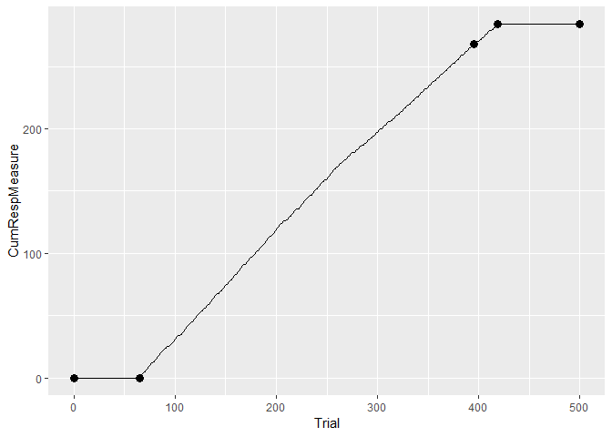
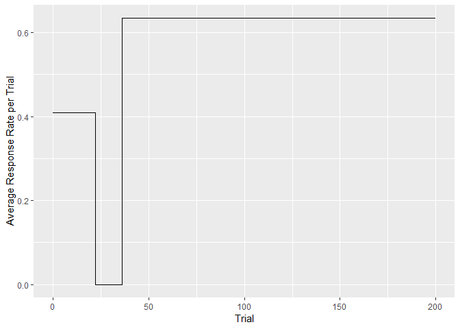

Description
===========

This package is for finding change points in sequences of responses. Putative change points are first detected, then a statistical test at a predefined significance level (Criterion) is applied to decide if the change point is supported or not. Based on algorithm published by Gallistel et al. (2004).

Installation
============

You can use `devtools` to install the package from Github. Install the devtools package first, then execute this code in R(Studio):

``` r
devtools::install_github('ontogenerator/cpdetectorr')
```

Examples
========

There is a main wrapper function, called `cp_wrapper`, which can be used to analyze sequences of responses. Currently only binary responses (containing ones and zeroes) are supported. The second argument of the function gives the statistical test (either "binomial", or "chisquare"). The different tests usually give similar, but often different results. The third and last argument is the criterion, with values between 1.3 and 6.

The input can be either a vector:

``` r
library(cpdetectorr) # load package first
cp_wrapper(c(rbinom(50,1,0.3), rbinom(50,1,0.8)), "binomial",2)
#>   Trial CumSs    Slopes
#> 1     0     0        NA
#> 2    47     9 0.1914894
#> 3   100    49 0.7547170
```

or a data frame:

``` r
d_responses <- data.frame(Responses = c(rbinom(50,1,0.3),
rbinom(50,1,0.8)))

cp_wrapper(d_responses, "chisquare",2)
#>   Trial CumSs    Slopes
#> 1     0     0        NA
#> 2    52    18 0.3461538
#> 3   100    61 0.8958333
```

For the same value of the criterion, the chi square test usually gives a higher number of change points (in this case, false positives). The value of the criterion should lie between 1.3 and 6, corresponding to p values of 0.05 and 0.000001, respectively. These values are the logarithms of the odds against the null (no-change) hypothesis.

Let us look first at the included eyeblink data set:

``` r
eyeblink[,] # inspect data set
#>   [1] 0 0 0 0 0 0 0 0 0 0 0 0 0 0 0 0 0 0 0 0 0 0 0 0 0 0 0 0 0 0 0 0 0 0 0
#>  [36] 0 0 0 0 0 0 0 0 0 0 0 0 0 0 0 0 0 0 0 0 0 0 0 0 0 0 0 0 0 0 1 1 1 1 1
#>  [71] 1 1 1 1 1 1 1 0 1 1 1 1 1 1 1 1 1 1 1 1 0 1 0 0 1 1 1 1 1 1 1 1 1 0 0
#> [106] 1 1 1 1 1 1 1 1 1 1 1 0 1 1 1 1 1 1 1 1 1 0 1 1 0 1 1 1 1 1 1 1 1 1 1
#> [141] 1 1 0 1 1 0 1 1 1 1 1 1 1 1 1 0 1 1 1 1 1 1 1 1 1 1 1 1 0 1 1 1 1 1 1
#> [176] 0 1 1 1 1 1 0 1 1 1 1 1 1 1 1 1 1 1 1 0 1 1 1 1 1 1 1 1 1 1 1 1 0 0 1
#> [211] 0 1 1 1 1 1 1 1 1 1 0 0 1 1 1 1 1 1 1 1 1 1 1 0 0 1 1 1 1 1 1 1 1 1 1
#> [246] 1 0 1 0 1 1 1 1 1 1 1 1 1 1 0 1 1 1 0 1 1 1 0 1 1 1 0 1 1 1 0 0 1 1 0
#> [281] 1 1 1 0 1 0 1 0 1 1 1 0 1 1 1 0 1 1 1 0 1 1 1 0 1 1 1 0 1 1 1 0 1 0 1
#> [316] 0 1 1 1 0 1 1 1 0 1 1 1 0 1 1 1 0 1 1 1 0 1 1 1 0 1 1 1 0 1 1 1 0 1 1
#> [351] 1 0 1 1 1 0 1 1 1 0 1 1 1 0 1 1 1 0 1 1 1 0 1 1 1 0 1 1 1 0 1 1 1 0 1
#> [386] 1 1 0 1 1 1 0 1 1 1 0 1 0 1 0 1 1 1 0 1 1 1 0 1 1 1 0 1 0 1 0 1 1 1 0
#> [421] 0 0 0 0 0 0 0 0 0 0 0 0 0 0 0 0 0 0 0 0 0 0 0 0 0 0 0 0 0 0 0 0 0 0 0
#> [456] 0 0 0 0 0 0 0 0 0 0 0 0 0 0 0 0 0 0 0 0 0 0 0 0 0 0 0 0 0 0 0 0 0 0 0
#> [491] 0 0 0 0 0 0 0 0 0 0
```

Gallistel et al. advise against using the chi square test on these data. Indeed, with a criterion of 2, the test fails:

``` r
cp_wrapper(eyeblink, "chisquare", 2)
```

However, using either a higher criterion or the "binomial" test gives a result:

``` r
cp_wrapper(eyeblink, "chisquare", 4)
#>   Trial CumSs    Slopes
#> 1     0     0        NA
#> 2    65     0 0.0000000
#> 3   500   284 0.6528736

cp_wrapper(eyeblink, "binomial", 2)
#>   Trial CumSs    Slopes
#> 1     0     0        NA
#> 2    65     0 0.0000000
#> 3   259   169 0.8711340
#> 4   411   279 0.7236842
#> 5   419   284 0.6250000
#> 6   500   284 0.0000000
```

With ggplot we can visualize the results by first generating a `data.frame` with the cumulative responses:

``` r
library(ggplot2) # load the ggplot package
eyeblinkdata <- data.frame(Trial = 1:length(eyeblink[,]),
                           CumRespMeasure = cumsum(eyeblink)[,])
changepoints <- cp_wrapper(eyeblink, "binomial", 4)

ggplot(eyeblinkdata) + geom_line(aes(Trial, CumRespMeasure)) +
  geom_point(data = changepoints, aes(Trial, CumSs), size = 3)
```



Another type of plot one can look at is the average response rate per trial vs trial. In this example we use the plusmaze data set included with the package.

``` r
plusmaze[,] # inspect data set
#>   [1] 0 1 0 0 1 0 0 1 1 0 0 0 1 0 0 0 0 1 1 1 0 1 0 0 0 0 0 0 0 0 0 0 0 0 0
#>  [36] 0 1 1 1 0 1 0 1 1 1 0 0 1 0 1 0 0 0 0 0 1 0 0 1 1 1 0 1 0 1 0 1 0 1 1
#>  [71] 1 0 1 1 1 1 0 1 0 0 0 0 1 0 1 0 0 0 0 1 0 1 0 1 1 1 0 1 0 1 1 0 1 1 1
#> [106] 0 1 1 0 1 0 1 1 1 1 0 0 1 1 1 0 1 0 1 0 1 0 1 1 1 1 1 1 0 0 1 1 1 1 0
#> [141] 1 1 0 0 1 1 0 1 1 1 1 0 1 1 1 1 1 0 1 1 1 1 0 1 1 1 1 1 0 1 1 0 1 0 0
#> [176] 0 1 1 1 1 1 0 1 1 1 0 0 1 1 1 1 1 0 1 1 0 1 1 1 1
(cp.1 <- cp_wrapper(plusmaze, "binomial", 1.3)) #find the change points
#>   Trial CumSs    Slopes
#> 1     0     0        NA
#> 2    22     9 0.4090909
#> 3    36     9 0.0000000
#> 4   200   113 0.6341463
# plot average response rate per trial, with dplyr::lead
ggplot() + geom_step(data=cp.1, aes(Trial,dplyr::lead(Slopes))) +
  ylab("Average Response Rate per Trial") # ignore Warning message
#> Warning: Removed 1 rows containing missing values (geom_path).
```



References
==========

1.  Gallistel CR, Fairhurst S, Balsam P (2004) The learning curve: Implications of a quantitative analysis. PNAS 101:13124-13131. doi: 10.1073/pnas.0404965101
