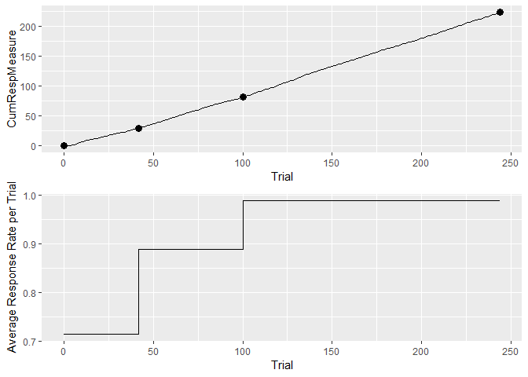
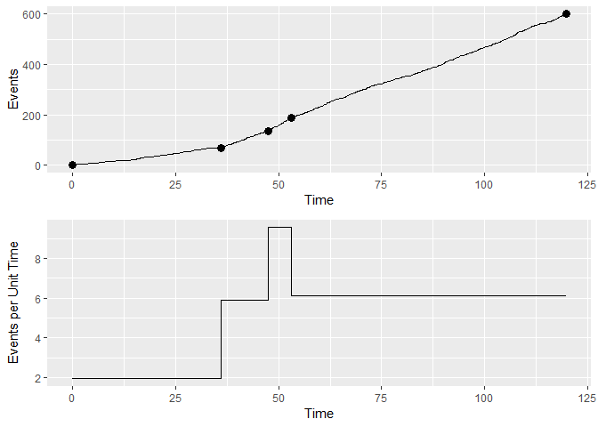

Description
===========

This package is for finding change points in sequences of responses. Putative change points are first detected, then a statistical test at a predefined significance level (Criterion) is applied to decide if the change point is supported or not. Based on algorithm published by [Gallistel et al. (2004)](http://dx.doi.org/10.1073/pnas.0404965101), translated from Matlab into R.

Installation
============

You can use `devtools` to install the package from Github. Install the devtools package first, then execute this code in R(Studio):

``` r
devtools::install_github('ontogenerator/cpdetectoR')
```

Examples
========

There is a main wrapper function, called `cp_wrapper`, which can be used to analyze sequences of responses. The first argument of the function is the input. Thes second argument indicates whether the input contains discrete-trial data (TRUE), or successive real value intervals (FALSE). The third argument gives the statistical test ("KS", "ttest", "binomial", or "chisquare"). The different tests usually give similar, but often different results. The third and last argument is the criterion, with values between 1.3 and 6.

The input can be either a vector:

``` r
library(cpdetectoR) # load package first
set.seed(25)
cp_wrapper(c(rbinom(50, 1, 0.3), rbinom(50, 1, 0.8)), TRUE, "binomial", 2)
#>   Trial CumSs    Slopes
#> 1     0     0 0.2173913
#> 2    46    10 0.8518519
#> 3   100    56 0.8518519
```

or a data frame:

``` r
d_responses <- data.frame(Responses = c(rbinom(50, 1, 0.3), rbinom(50, 1, 0.8)))
cp_wrapper(d_responses, TRUE, "chisquare", 2)
#>   Trial CumSs Slopes
#> 1     0     0   0.08
#> 2    25     2   0.36
#> 3    50    11   0.82
#> 4   100    52   0.82
```

For the same value of the criterion, the chi square test usually gives a higher number of change points (in this case, false positives) than the binomial test. The value of the criterion should lie between 1.3 and 6, corresponding to p values of 0.05 and 0.000001, respectively. These values are the logarithms of the odds against the null (no-change) hypothesis.

Let us look first at the included `eyeblink` data set:

``` r
eyeblink[,] # inspect data set
#>   [1] 0 0 0 0 0 0 0 0 0 0 0 0 0 0 0 0 0 0 0 0 0 0 0 0 0 0 0 0 0 0 0 0 0 0 0
#>  [36] 0 0 0 0 0 0 0 0 0 0 0 0 0 0 0 0 0 0 0 0 0 0 0 0 0 0 0 0 0 0 1 1 1 1 1
#>  [71] 1 1 1 1 1 1 1 0 1 1 1 1 1 1 1 1 1 1 1 1 0 1 0 0 1 1 1 1 1 1 1 1 1 0 0
#> [106] 1 1 1 1 1 1 1 1 1 1 1 0 1 1 1 1 1 1 1 1 1 0 1 1 0 1 1 1 1 1 1 1 1 1 1
#> [141] 1 1 0 1 1 0 1 1 1 1 1 1 1 1 1 0 1 1 1 1 1 1 1 1 1 1 1 1 0 1 1 1 1 1 1
#> [176] 0 1 1 1 1 1 0 1 1 1 1 1 1 1 1 1 1 1 1 0 1 1 1 1 1 1 1 1 1 1 1 1 0 0 1
#> [211] 0 1 1 1 1 1 1 1 1 1 0 0 1 1 1 1 1 1 1 1 1 1 1 0 0 1 1 1 1 1 1 1 1 1 1
#> [246] 1 0 1 0 1 1 1 1 1 1 1 1 1 1 0 1 1 1 0 1 1 1 0 1 1 1 0 1 1 1 0 0 1 1 0
#> [281] 1 1 1 0 1 0 1 0 1 1 1 0 1 1 1 0 1 1 1 0 1 1 1 0 1 1 1 0 1 1 1 0 1 0 1
#> [316] 0 1 1 1 0 1 1 1 0 1 1 1 0 1 1 1 0 1 1 1 0 1 1 1 0 1 1 1 0 1 1 1 0 1 1
#> [351] 1 0 1 1 1 0 1 1 1 0 1 1 1 0 1 1 1 0 1 1 1 0 1 1 1 0 1 1 1 0 1 1 1 0 1
#> [386] 1 1 0 1 1 1 0 1 1 1 0 1 0 1 0 1 1 1 0 1 1 1 0 1 1 1 0 1 0 1 0 1 1 1 0
#> [421] 0 0 0 0 0 0 0 0 0 0 0 0 0 0 0 0 0 0 0 0 0 0 0 0 0 0 0 0 0 0 0 0 0 0 0
#> [456] 0 0 0 0 0 0 0 0 0 0 0 0 0 0 0 0 0 0 0 0 0 0 0 0 0 0 0 0 0 0 0 0 0 0 0
#> [491] 0 0 0 0 0 0 0 0 0 0
```

Gallistel et al. advise against using the chi square test on these data. Indeed, with a criterion of 2, the test fails:

``` r
cp_wrapper(eyeblink, TRUE, "chisquare", 2)
```

However, using either a higher criterion or the "binomial" test gives a result:

``` r
cp_wrapper(eyeblink, TRUE, "chisquare", 3)
#>   Trial CumSs    Slopes
#> 1     0     0 0.0000000
#> 2    65     0 0.6528736
#> 3   500   284 0.6528736

cp_wrapper(eyeblink, TRUE, "binomial", 2)
#>   Trial CumSs    Slopes
#> 1     0     0 0.0000000
#> 2    65     0 0.8711340
#> 3   259   169 0.7236842
#> 4   411   279 0.6250000
#> 5   419   284 0.0000000
#> 6   500   284 0.0000000
```

With ggplot we can visualize the results by first generating a `data.frame` with the cumulative responses:

``` r
library(ggplot2) # load the ggplot package
eyeblinkdata <- data.frame(Trial = 1:length(eyeblink[,]),
                           CumRespMeasure = cumsum(eyeblink)[,])
changepoints <- cp_wrapper(eyeblink, TRUE, "binomial", 4) # save the output of the change point analysis
#generate a cumulative response vs trial plot:
ggplot(eyeblinkdata) + geom_line(aes(Trial, CumRespMeasure)) +
  geom_point(data = changepoints, aes(Trial, CumSs), size = 3)
```


Another type of plot one can look at is the average response rate per trial vs trial. The `plusmaze` data set included with the package contains frequency data, that are again preferrably analyzed with the random rate (binomial) test.

``` r
plusmaze[,] # inspect data set
#>   [1] 0 1 0 0 1 0 0 1 1 0 0 0 1 0 0 0 0 1 1 1 0 1 0 0 0 0 0 0 0 0 0 0 0 0 0
#>  [36] 0 1 1 1 0 1 0 1 1 1 0 0 1 0 1 0 0 0 0 0 1 0 0 1 1 1 0 1 0 1 0 1 0 1 1
#>  [71] 1 0 1 1 1 1 0 1 0 0 0 0 1 0 1 0 0 0 0 1 0 1 0 1 1 1 0 1 0 1 1 0 1 1 1
#> [106] 0 1 1 0 1 0 1 1 1 1 0 0 1 1 1 0 1 0 1 0 1 0 1 1 1 1 1 1 0 0 1 1 1 1 0
#> [141] 1 1 0 0 1 1 0 1 1 1 1 0 1 1 1 1 1 0 1 1 1 1 0 1 1 1 1 1 0 1 1 0 1 0 0
#> [176] 0 1 1 1 1 1 0 1 1 1 0 0 1 1 1 1 1 0 1 1 0 1 1 1 1
(cp.1 <- cp_wrapper(plusmaze, TRUE, "binomial", 1.3)) #find the change points
#>   Trial CumSs    Slopes
#> 1     0     0 0.4090909
#> 2    22     9 0.0000000
#> 3    36     9 0.6341463
#> 4   200   113 0.6341463
# plot average response rate per trial
ggplot() + geom_step(data = cp.1, aes(Trial,Slopes)) +
  ylab("Average Response Rate per Trial")
```


``` r
# for comparison, the cumulative response vs trial plot, as in the example above:
plusmazedata <- data.frame(Trial = 1:length(plusmaze[,]),
                           CumRespMeasure = cumsum(plusmaze)[,])
ggplot(plusmazedata) + geom_line(aes(Trial, CumRespMeasure)) +
  geom_point(data = cp.1, aes(Trial, CumSs), size = 3)
```


The attached data set `hopperentry` contains hopper-entry speeds from pigeons, an example of normally distributed data. Consequently the t test can be used.

``` r
(cp.2 <- cp_wrapper(hopperentry, TRUE, "ttest", 4)) #find the change points
#>   Trial     CumSs    Slopes
#> 1     0   0.00000 0.7132600
#> 2    42  29.95692 0.8891728
#> 3   100  81.52894 0.9880297
#> 4   244 223.80522 0.9880297
# cumulative response vs trial plot
hedata <- data.frame(Trial = 1:length(hopperentry[,]),
                           CumRespMeasure = cumsum(hopperentry)[,])
pl1 <- ggplotGrob(ggplot(hedata) + geom_line(aes(Trial, CumRespMeasure)) +
  geom_point(data = cp.2, aes(Trial, CumSs), size = 3))
# plot average response rate per trial
pl2 <- ggplotGrob(ggplot(cp.2) + geom_step(aes(Trial, Slopes)) +
  ylab("Average Response Rate per Trial"))
# stack the two plots vertically using the grid package
grid::grid.draw(rbind(pl1, pl2, size = "first"))
```



An example for continuous data is the attached `matching` data set. The plots need different axes and labels:

``` r
(cp.3 <- cp_wrapper(matching, FALSE, "binomial", 2)) #find the change points
#>        Time Events   Slopes
#> 1   0.00000      0 1.934973
#> 2  36.17621     70 5.898969
#> 3  47.53413    137 9.559500
#> 4  53.07835    190 6.138859
#> 5 119.86601    600 6.138859
# cumulative response vs trial plot
matchingdata <- data.frame(Events = 1:length(matching[,]),
                           Time = cumsum(matching)[,])
pl3 <- ggplotGrob(ggplot(matchingdata) + geom_line(aes(Time, Events)) +
  geom_point(data = cp.3, aes(Time, Events), size = 3))
# plot average response rate per trial
pl4 <- ggplotGrob(ggplot(cp.3) + geom_step(aes(Time, Slopes)) +
  ylab("Events per Unit Time"))
grid::grid.draw(rbind(pl3, pl4, size = "first"))
```



References
==========

1.  Gallistel CR, Fairhurst S, Balsam P (2004) The learning curve: Implications of a quantitative analysis. PNAS 101:13124-13131. doi: 10.1073/pnas.0404965101
